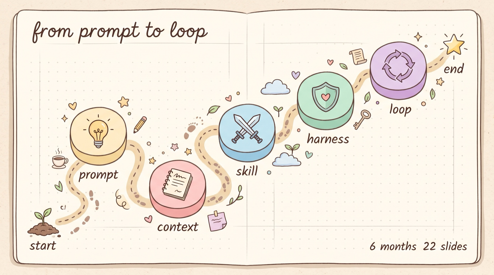

# pretty-skills 22 幕 talk 演示站



> **GitHub 源**：[huangrichao2020/huangrichao2020](https://github.com/huangrichao2020/huangrichao2020)
> **在线部署**：<https://www.ai10088.com/skill-arsenal/>
> **本地仓库**：`~/.mavis/knowledge/huangrichao2020/`

## 3 个名字对应

| 名字 | 在哪 | 是什么 |
|---|---|---|
| `huangrichao2020` | GitHub 仓库 / 本地目录 | git 源 |
| `skill-arsenal` | 在线 URL / aliyun 目录 | nginx 部署路径 |
| `pretty-skills-talk` | 历史名（已改） | 原 GitHub 仓库名 |

`skill-arsenal` 是部署路径的命名约定，跟 git 源仓库名解耦——这样改 GitHub 仓库名不影响线上 URL。

## 这是什么

pretty-skills 仓库的线下分享 22 幕讲解站。从 P0 封面到 P22 skill 拆解，1920×1080 视口，左右方向键翻页。

| 字段 | 值 |
|---|---|
| 讲者 | 汀池（前钉钉原厂交付经理） |
| 主题 | 比养 Agent 更重要的是养你的 skill 武器库 |
| 时长 | 30-40 分钟 |
| 风格 | 商务科技蓝白灰 |
| 幕数 | 22 幕（不含 cover/closing） |

## 文件结构

```
huangrichao2020/              # 仓库根目录
├── index.html              # 单文件 · 22 幕全在这里 · 直接编辑
├── speaker.jpg             # 汀池头像 · 99KB · 备用（未在主稿引用）
├── case-9grid/
│   └── ppt-9grid.png       # 9 宫图参考 · 5.86MB · P21 讲解用
└── README.md
```

## 怎么改

直接改 `index.html`，每个 `<section class="slide" data-slide="N">` 是一幕。

- 改完本地浏览器开 `index.html` 看效果
- 推送后部署到 aliyun：`rsync -avz ./ aliyun:/www/wwwroot/skill-arsenal/`

## 部署

- **域名**：`ai10088.com/skill-arsenal/`
- **服务器**：aliyun `120.26.32.59:33`
- **路径**：`/www/wwwroot/skill-arsenal/`
- **nginx**：`/etc/nginx/conf.d/skill-arsenal.conf` · 静态文件直接 serve

## 22 幕清单

| 幕 | 主题 | 编号 |
|---|---|---|
| P0  | 封面 | 01 |
| P1  | 痛点 | 02 |
| P1.5| 对话 1 | 03 |
| P2  | 总纲 | 04 |
| P3  | 范式 | 05 |
| P3.5| skill 是什么 | 06 |
| P3.7| 对话 2 | 07 |
| P4  | 拐点 | 08 |
| P5  | harness 是什么 | 09 |
| P6  | 9 维评分 | 10 |
| P6.5| 对话 3 | 11 |
| P7  | harness 反面 | 12 |
| P8  | harness 正面 | 13 |
| P8.5| 3 层架构 | 14 |
| P9  | 7 天 122 commits | 15 |
| P10 | 3 状态工作 | 16 |
| P11 | 对话 4 | 17 |
| P12 | 对话 5 | 18 |
| P13 | 对话 6 | 19 |
| P14 | harness vs loop | 20 |
| P15 | CTA · 三个问题 | 21 |
| P16 | skill 拆解 · ai-image-to-pptx | 22 |

> 注：编号按 slide-num 展示顺序，不是 data-slide 内部 ID。

## License

MIT
