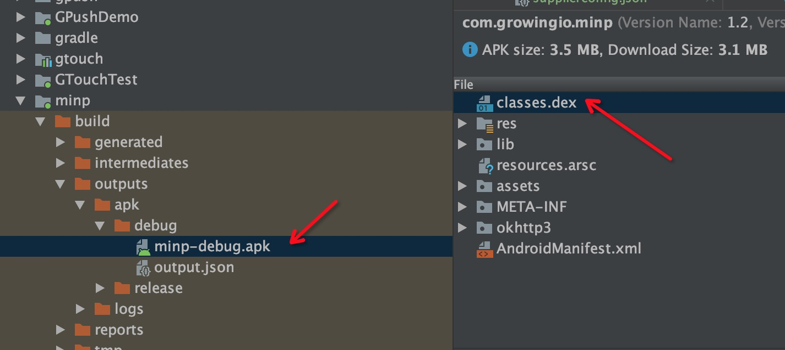

## 发版到本地
发sdk   
- 先在build.gradle里修改 targetVersion
- 发无埋点就用autotrack开头，发埋点就用track开头
- 再去gradle管理里，vds-android-agent.publishing里执行publishToMavenLocal
- 本地发到com.growingio.android.test:t-vds-andorid-agent:autotrack-2.8.7-beta
- gtouch根项目里引用 com.growingio.android.test:t-vds-gradle-plugin:autotrack-2.8.7-beta，modlue里引用com.growingio.android.test:t-vds-andorid-agent:autotrack-2.8.7-beta
- 如果是track-2.8.7-beta的话，则无须引用plugin

## 各类事件
事件大类 事件小类
无埋点事件 visit、page、action、action_tag
埋点事件 custom_attr
广告相关 ads_track_click、ads_track_activation

### visit
- web30分钟过期session
- 移动端 30秒过期 session


## land与打tag
- git tag 1.2.0
- 删tag git push origin :refs/tags/tag-name

## 将jar包打成dex包
- publishToMavenLocal
- 
## 测量协议部分
部分与CDP类似

- page:打开新页面 t:page u p tl cd1 esid：请求id
- vst:新访问 u t cs1 fv:{au：无埋点版本 ra：RN版本 tv：触达版本}
- activate: app首次请求
- reengage: Deeplink请求
- clck：点击 u t p e cs1
- imp:元素展现 u t p e cs1
- chng:输入元素改变 u s t p e
- cstm:track类型 u s t d !!var num
- pvar:setPageVariable 
- vstr:setVisitor
- evar:setEvar
- ppl:setPeopleVariable

- android version 为版本号+最近一次commit号
- vst事件不上传app.id,app.user_agent,device.type,screen.orientation
- page字段只有web与小程序有

## 事件
- activate事件在应用卸载重装或第一次安装或清除数据第一次打开时发送
- 发送时带oaid数据
- oaid sdk见 https://swsdl.vivo.com.cn/appstore/developer/uploadfile/20191109/d6Ybr5/%E7%A7%BB%E5%8A%A8%E6%99%BA%E8%83%BD%E7%BB%88%E7%AB%AF%E8%A1%A5%E5%85%85%E8%AE%BE%E5%A4%87%E6%A0%87%E8%AF%86%E4%BD%93%E7%B3%BB%E7%BB%9F%E4%B8%80%E8%B0%83%E7%94%A8SDK%E5%BC%80%E5%8F%91%E8%80%85%E8%AF%B4%E6%98%8E%E6%96%87%E6%A1%A3v1.10.pdf


## 查看apk里的依赖包

双击apk文件，打开dex文件

## 安卓方法链
ActivityLifecycleEvent.getActivity().getClass().getSimpleName()


## Deep Link
GrowingIO.startWithConfiguration(this, new Configuration()
    .setDeeplinkCallback(new DeeplinkCallback() {
                @Override
                public void onReceive(Map<String, String> params, int status) {
                     if (status == DeeplinkCallback.SUCCESS) {
                        //获得您的自定义参数，处理您的相关逻辑
                        Log.d("TestApplication", "DeepLink 参数获取成功，params" + params.toString());
                    }
                    if (status == DeeplinkCallback.NO_QUERY) {

                    }
                }
            })
);

## 广告数据查询

```
实时数据查询：gio.ads_track_click，gio.ads_track_activation

历史数据查询：gio.ads_track_activation_history，gio.ads_track_click_history

time格式：实时201912240200，历史格式20191223


单个用户数据查询：可根据IP/设备ID查询（adrid，ui，iv）

广告点击数据：select  channel_name，link_id，link_name，origin_data from gio.ads_track_click_history where time='20191223' and ai='aa34e8592b0f2d3a' and platform='Android' and ip='118.194.240.141'  or get_json_object(origin_data,"$.adrid")=‘设备ID’

广告激活数据：select  channel_name，link_id，link_name，origin_data from gio.ads_track_activation_history where time='20191223' and ai='aa34e8592b0f2d3a' and platform='Android' and ip='118.194.240.141'  or  get_json_object(origin_data,"$.adrid")=‘设备ID’  and t='activate'

广告唤醒数据：select  channel_name，link_id，link_name，origin_data from gio.ads_track_activation_history where time='20191223' and ai='aa34e8592b0f2d3a' and platform='Android' and ip='118.194.240.141'  or  get_json_object(origin_data,"$.adrid")=‘设备ID’  and t='reengage'


单条监测链接/单个渠道数据查询
```