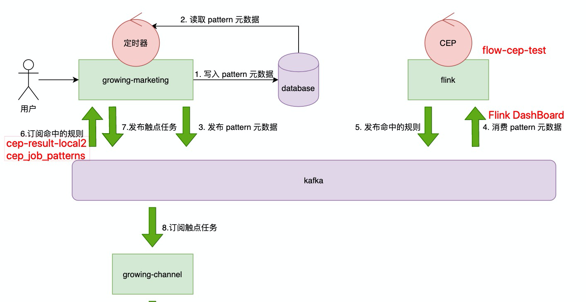

## minp配置
https://push.oppo.com/conf/app-configuration 
```
AppId
30169084
AppKey
d5b8de18e1b34de9950e003321355ae4
AppSecret
0e6cdaea2cee49c48bc449472674a71c
MasterSecret
60ad268054ce4a4c8aba79b33efa3bd1
```
https://vpush.vivo.com.cn/#/homePage/appDetail
```
AppID：16033
AppKey：d04a505a-acee-42ac-8663-df7f71038ab3
AppSecret：8760c185-4bbb-4558-9103-76f0fe72074a
```
http://push.meizu.com/#/config/app?appId=21394&_k=qordhf
```
App ID    
131199
App Key    
90dec33fb7804394ae5e0a8c898621f5
App Secret    
1f704bbf758c4d8782ac988d47a36445
```
https://developer.huawei.com/consumer/cn/service/josp/agc/index.html#/myApp/101817817
```
APP ID：
101817817
SecretKey：
ee3a4295ee8b6a44f3f48611d93e18e9dfdafebb40b8c52399f028111f9771f7
```
https://admin.xmpush.xiaomi.com/zh_CN/app/info?appId=2882303761518226280
```
AppID
2882303761518226280
AppKey
5141822671280
AppSecret
iCuCBnkeo83+YzWxWOCy4g==
```

## 电商配置
https://open.oppomobile.com/home/management/app-admin#/service/oms?service_id=1000004&app_type=app&app_id=30089357
```
AppID： 30089357
AppKey： c5b6561903914d6eb90f68c0a9c57259
AppSecret： 2169638acf5044be84636ef0425c813b
MasterSecret：等待审核通过
```
vivo无

http://push.meizu.com/#/config/app?appId=11538&_k=rym0bp
```
App ID    121348
App Key    7bf587c9769441a9b70a951805d247d2
App Secret    347cb66a36714bb5a2c97bc13eb9970e
```

https://developer.huawei.com/consumer/cn/service/josp/agc/index.html#/myApp/101808059
```
APP ID：101808059
SecretKey：35328453cdf489dbcf3d1254f50de1251bc0470ef8d8b1e22e1a52427bf42474
```
https://admin.xmpush.xiaomi.com/zh_CN/app/info?appId=2882303761518333615
```
AppID 2882303761518333615
AppKey 5281833332615 
AppSecret P5/S5Bym5mEn6qJgLKwIMQ==
```

## 参考链接
[CSDN文章](https://blog.csdn.net/zwgdft/article/details/53561277)
模式：某场景下的某类问题+其解决方案的总结。
消息中间件：生产消费+订阅发布

### 数据接入


App上报用户行为数据（生成者） --> 服务端存数据进消息队列 --> worker从队列取数据（消费者）
**发数的是生产者，取数的是消费者**
- 功能分离
- 数据缓冲 支持大量上报不丢数据，且稳定取数处理
- 数据量大时可弹性添加worker，提高效率

### 数据处理


事件分发系统：各个模块中把对应的事件发到消息中心，消费者通过事件订阅处理器对事件进行处理。
四个角色：业务模块，消息中心，订阅处理器，消费者

消息中间件：Producer Client ，Consumer Client 通过connection与MQ Sever建立长连接，通过channel分配临时逻辑通道。
消息体：Attributes携带元消息与payLoad携带消息实体

MQ Sever由Excange与Queue组成，Producer不能直接将Message传给Queue，他只能在生成Message时给它指定一个指定key并送到Exchange，Exchange通过routing_key将Message送达对应的Queue，每个Consumer有对应的Queue，需要声明对哪个Exchange感兴趣，并绑定Queue与routing_key。

很明显，Exchange只通过routing_key绑定Queue有点蠢，所以只有默认的Direct Exchange才会这样按key推Message。
Fanout Exchange 忽略key给所有Queue推Message。
Topic Exchange使用模糊匹配给对应的一组key推送Message。
Header Exchange 忽略key，按Header推送Message。

Producer如何知道消息可靠地送达Consumer，Consumer收到Message后会给MQ Sever一个确认消息，如果Consumer挂了则Sever会重发。Sever重启的话需要评估一下数据丢失的风险。

**生产消费**

common key and special key 
**发布订阅**
EventConsumerA对eventKeyA与eventKeyB感兴趣，则绑定这两个key到QueueA。
订阅：将自己的Queue绑定感兴趣的key。
**总结**
核心是key。生产者发出Message到Excahnge时要指定key。消费者声明Exchange后也要绑as定key与Queue

## Kafka

Worker - topic - Partition(ServerA)-Worker1(ConsumerGroup)

kafka写入数据，进磁盘后无法删除

消费者读取数据

每个Consumer需要从Zookeeper里获取Partition与offset信息，不然无法读取数据。

同步与异步
MMAP形式存储的kafka数据，如果数据写入到mmap后立即flush再返回producer叫同步，写入到mmap后立即返回叫异步


## 测试相关token
- 2020-05-08 10:21:24.571 9310-9310/com.growingio.minp E/PushMessageReceiver: onRegister: channel = Meizu, pushToken = Z9K487e04780b707d637c5f4269490c5c094279027d01


## 应用推送配置
minp.xiaomi 
- AppID 2882303761518226280
- AppKey 5141822671280
- AppSecret iCuCBnkeo83+YzWxWOCy4g==

GTouch.xiaomi
- AppID 2882303761518012361
- AppKey 5741801265361
- AppSecret LamSSRM3v2H2P7wogk6DXQ==

Shopping.xiaomi
- AppID 2882303761518333615
- AppKey 5281833332615
- AppSecret P5/S5Bym5mEn6qJgLKwIMQ==

minp.huawei
- App ID 101817817
- SecrectKey ee3a4295ee8b6a44f3f48611d93e18e9dfdafebb40b8c52399f028111f9771f7

GTouch.huawei
- App ID 101807675
- SecrectKey 035aed4c6bbd3d4d9a61d30a9b3c5531c6689e6a862de9d55eaf11966e3aea48

Shopping.huawei
- App ID 101808059
- SecrectKey 35328453cdf489dbcf3d1254f50de1251bc0470ef8d8b1e22e1a52427bf42474


minp.meizu
- AppID 121478
- AppSecrect a4cb1485d8f344059f3146256481fce8

GTouch.meizu
- AppID 121478
- AppKey fafc10504d064487ba4adebfa71a4248
- AppSecrect a4cb1485d8f344059f3146256481fce8

minp.oppo
- AppID 30169084
- AppKey d5b8de18e1b34de9950e003321355ae4
- AppSecrect 0e6cdaea2cee49c48bc449472674a71c

minp.vivo
- AppID 16033
- AppKey d04a505a-acee-42ac-8663-df7f71038ab3
- AppSecrect 8760c185-4bbb-4558-9103-76f0fe72074aå


## 测试环境
- 部署diff：gio-flow。JOB:realtime-cep http://test-browser.growingio.com:8080/view/Staging/job/gio-flow-staging/40/parameters/
- 或 http://10.1.1.62:8080/view/Staging/job/gio-flow-staging/43/
- 查看realtime-cep读取哪个数据库：https://codes.growingio.com/source/gio-flow/browse/master/conf/staging/global/common.conf
- 查看realtime-cep服务状态起来没：http://qa-hd0:8088/cluster/apps 。执行了jenkins也没起来的话需要进入qa-online0的/apps/flink/realtime-cep/current/目录下执行 bin/start.sh restart realtime-cep
- 查看是否因为全局推送配置导致推送发不出去，进入服务所在目录：grep caped app.log


事件流

- 本地kafka订阅topic查看数据端数据是否进入flink.cep：./bin/kafka-console-consumer.sh  --bootstrap-server 10.1.1.232:9092,10.1.1.176:9092,10.1.1.105:9092  --group flow-cep-test --topic vds-api-custom-action


- bin/kafka-console-consumer.sh  --bootstrap-server 10.1.1.232:9092,10.1.1.176:9092,10.1.1.105:9092  --group flow-cep-test --whitelist 'vds-api-custom-action|vds-api-custom-action-test|vds-api-minp-custom-action'


- ./bin/kafka-console-consumer.sh  --bootstrap-server 10.1.1.232:9092,10.1.1.176:9092,10.1.1.105:9092  --group cep-result-local2 --topic vds-api-cep-sink

核心用例:

payOrder,couponName_var,iphone8
payOrderSuccess,payAmount_var,100

## 测试机
OPPO 0511
{
	"platform": "Android",
	"brand": "OPPO PBAT00",
	"channelName": "Oppo",
	"sdkVersion": "1.3.3",
	"appVersion": "1.0",
	"deviceId": "fd51fb0e-7ac7-3a2a-bbef-02b5a9002d21",
	"regId": "CN_2d18c9356dcd8b8db56500b2fba510d6",
	"authToken": "3b37adca-e642-424f-9964-ebf23e377f35",
	"userId": "a9BL8qwP",
	"productId": "q9ApEpoW"
}

{
      "id": 3917,
      "state": "activated",
      "name": "弹窗20190918154225",
      "content": "https://statics.growingio.com/pages/20190918/3/1568793646022/1568793646022-popupWindow.html?url_scheme=growing.638b52710867187c",
      "priority": 1,
      "index": 0,
      "updateAt": 1568793646215,
      "rule": {
        "target": "GInApp://app.growingio.com/notification-settings",
        "endAt": 4102416000000,
        "startAt": 1568792522499,
        "triggerPages": [],
        "triggerCd": 86400,
        "triggerDelay": 0,
        "limit": 1,
        "filters": {
          "expr": "(a || b || c) && (d && e && f)",
          "exprs": [
            {
              "symbol": "a",
              "op": "==",
              "type": "loginUserFilter",
              "valueType": "int",
              "values": [
                "10"
              ],
              "key": "imgOpenCnt"
            },
            {
              "symbol": "b",
              "op": "!=",
              "type": "loginUserFilter",
              "valueType": "string",
              "values": [
                "否"
              ],
              "key": "是否付费"
            },
            {
              "symbol": "c",
              "op": "in",
              "type": "loginUserFilter",
              "valueType": "string",
              "values": [
                "GrowingIO"
              ],
              "key": "project_name"
            },
            {
              "symbol": "d",
              "op": "=",
              "type": "eventFilter",
              "valueType": "int",
              "values": [
                "10"
              ],
              "key": "imgOpenCnt"
            },
            {
              "symbol": "e",
              "op": "=",
              "type": "eventFilter",
              "valueType": "string",
              "values": [
                "GrowingIO"
              ],
              "key": "project_name"
            },
            {
              "symbol": "f",
              "op": "=",
              "type": "eventFilter",
              "valueType": "string",
              "values": [
                "GrowingIO"
              ],
              "key": "org_name"
            }
          ]
        },
        "triggerFilter": {
          "conditionExpr": "A",
          "conditions": [
            {
              "type": "event",
              "alias": "A",
              "key": "touch1",
              "measurementType": "custom",
              "aggregator": "count",
              "op": ">=",
              "values": [
                3
              ],
              "dimFiltersOp": "and",
              "dimFilters": [
              ],
              "attribute": "money"
            }
          ]
        }
      },
      "abTest": {
        "dimension": "vstr_gio_ma_abtest_86",
        "symbol": "A1",
        "ctrlGroup": false
      }
    }