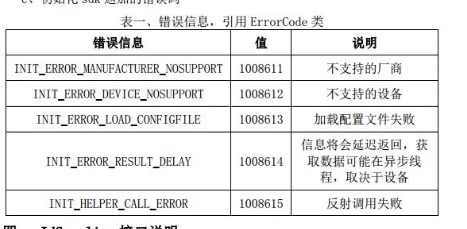
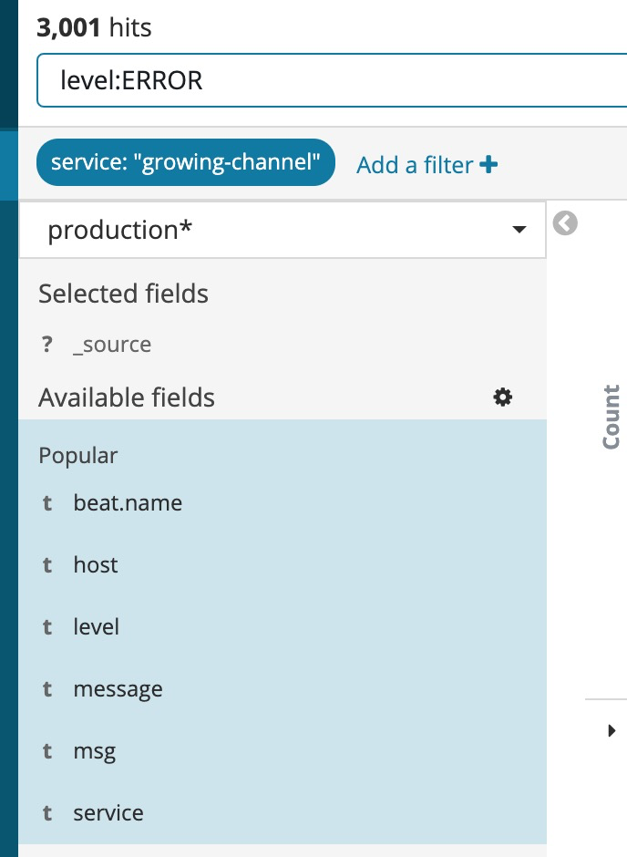
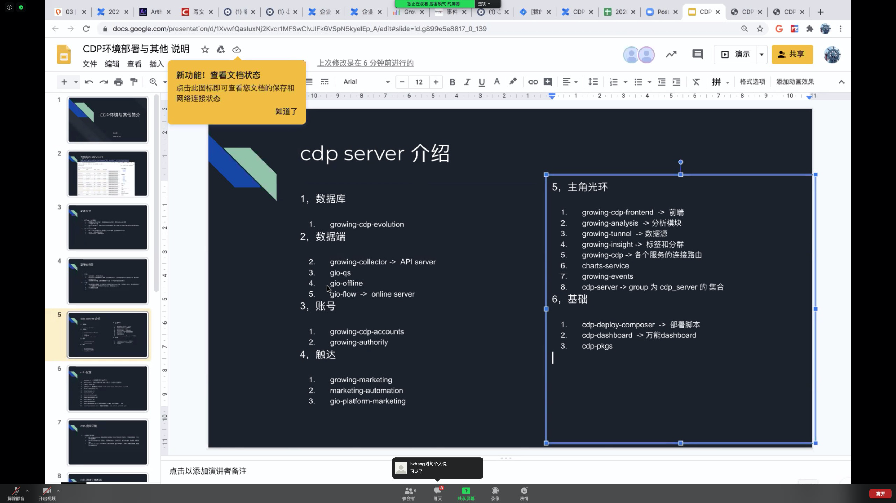

# 目录
- 私库怎么上传测试sdk
- bintray怎么通过api删库
- 

## 获取app的SHA256

- keytool -list -v -keystore minp.jks 
- keytool -printcert -jarfile ./minp-debug.apk
- keytool -printcert -jarfile ./minp-release.apk  不同的包对应不同的指令

## 绩效写法
- Bug SLA bug质量
- Bug RCA bug复盘


## 本地发版埋点sdk
```
#!/usr/bin/env bash

# 用于发布Android SDK到jcenter上
# 此脚本需要环境变量如下:
# pb_pf: 发布方式： test official
# pb_vs: 发布版本
# pb_vaa: 是否发布vds-android-agent
# pb_vgp: 是否发布gradle-plugin
# pb_all: 是否需全量发布

set -e
pb_pf="official"
pb_vs="2.8.20"
pb_vaa=true
pb_rva=true
pb_vgp=true
pb_all=true

function publish(){
	versionName=$1
	echo "开始发布版本:" $versionName
	# bintrayUpload会首先判断文件是否存在
	./gradlew -P pb_vs=$versionName -P pb_pf=$pb_pf -P pb_vaa=$pb_vaa -P pb_vgp=$pb_vgp clean assembleAar :vds-gradle-plugin:install
	./gradlew -P pb_vs=$versionName -P pb_pf=$pb_pf -P pb_vaa=$pb_vaa -P pb_vgp=$pb_vgp bintrayUpload --info
}

if [ "$pb_all" == "true" ]
else
	echo "发布单个版本：" $pb_vs
	publish $pb_vs
fi

echo "================== 发布完成 ==================== "

```

CDP
```
#!/usr/bin/env bash

# 用于发布Android SDK到jcenter上
# 此脚本需要环境变量如下:
# pb_pf: 发布方式： test official
# pb_vs: 发布版本
# pb_vaa: 是否发布vds-android-agent
# pb_vgp: 是否发布gradle-plugin
# pb_all: 是否需全量发布

set -e
pb_pf="official"
pb_vs="cdp-1.2.4"
pb_vaa=true
pb_rva=true
pb_vgp=false
pb_all=false

./gradlew clean
&& ./gradlew test

function publish(){
  versionName=$1
  echo "开始发布版本:" $versionName
  # bintrayUpload会首先判断文件是否存在
  ./gradlew -P pb_vs=$versionName -P pb_pf=$pb_pf -P pb_vaa=$pb_vaa -P pb_vgp=$pb_vgp assembleAar :vds-gradle-plugin:install
  ./gradlew -P pb_vs=$versionName -P pb_pf=$pb_pf -P pb_vaa=$pb_vaa -P pb_vgp=$pb_vgp bintrayUpload --info
}

if [ "$pb_all" == "true" ]
then
  echo "发布全量版本： RN-autotrack-"$pb_vs ", autotrack-"$pb_vs ", RN-track-"$pb_vs ", track-"$pb_vs
  publish RN-autotrack-$pb_vs
  publish RN-track-$pb_vs
  publish track-$pb_vs
  publish autotrack-$pb_vs
else
  echo "发布单个版本：" $pb_vs
  publish $pb_vs
fi

echo "================== 发布完成 ==================== "
已读

```

## deeplink跳转内部页
剪切板设计文档：https://growingio.atlassian.net/wiki/spaces/ads/pages/942310739/Deferred+Deeplink

```
.setDeeplinkCallback(new DeeplinkCallback() {
    @Override
    public void onReceive(Map<String, String> params, int error, long tmClick) {
        LogUtil.d("RApplication", "params  -->" + params + "  error  -->" + error + " tmClick  -->" + tmClick);
        Intent intent = new Intent();
        intent.setClass(getApplicationContext(), TestPageActivity.class);
        intent.putExtra("name",params.get("name"));
        intent.addFlags(Intent.FLAG_ACTIVITY_NEW_TASK);
        startActivity(intent);
    }
})
```


## minp-cdp
meizu
```
2020-07-08 10:38:04.131 8468-8491/com.growingio.minp W/GIO.DBAdapter: save instant Message: {"s":"04a07a83-13b8-4b4a-a329-9ff976ebb1ae","t":"user","tm":1594175884106,"gioId":"meizu_lisi","d":"com.growingio.minp","cs1":"meizu_lisi","var":{"gio_push_channel":"Meizu","gio_push_token":"Z496e0602745b634502000c4a7d000542796501017f50","gio_push_package":"com.growingio.minp","gio_notification_enabled":true,"gio_push_device_brand":"Meizu"},"gesid":38,"esid":14}
```
vivo能唤醒能上报测试机信息
```
2020-07-09 10:10:52.843 11451-11473/com.growingio.minp D/GIO.MessageUploader: GIO-CDP cstm : # io.growing.collector.tunnel.protocol.EventDto@97e413c1
    anonymous_id: "a9ea231c-d329-35c8-b1c7-97f23266dfe8"
    context {
      device {
        platform: "Android"
      }
    }
    data_source_id: "898c864030bcdabe"
    esid: 13
    event_key: "gio_touch_message_change"
    gio_id: "vivo_lisi"
    project_key: "a500f222e29e3b0c"
    send_time: 1594260652800
    session: "7027651e-e269-44e6-8137-5326da06eb3b"
    timestamp: 1594260651630
    type: CUSTOM_EVENT
    type_value: 1
    user_id: "vivo_lisi"
    attributes {description=}
```

## demo获取oaid的方法
- OaidHelper里有相关的方法，调用即可
相关task：https://growingio.atlassian.net/browse/PI-25237

- 错误信息


- json等静态文件放在src/main/assets路径下即可

## 获取deeplink剪切板内容
通过`用户通过延迟深度链接方式打开` 在gandroid项目里搜索到相关判断源码，将里面的部分源码粘贴到demo里，点击按钮执行这部分源码，并打印log
```
ClipboardManager cm = (ClipboardManager) getSystemService(CLIPBOARD_SERVICE);
ClipData clipData = cm != null ? cm.getPrimaryClip() : null;
ClipData.Item item = clipData.getItemAt(0);
String mimeType = clipData.getDescription().getMimeType(0);
Log.e(TAG, "onClick: mimeType = "+mimeType);
```

## 排查AS打包异常问题
- ./gradlew :[moduleName]:taskName -d
- 或assemble一下
- 提示某个模块的classNotFound，去对应的模块执行bundLibRuntimeDebug

## 查gdp-test环境相关的ip地址

查看服务 http://gdp-test.growingio.com/_dashboard/hosts
重启服务 http://gdp-test.growingio.com/_dashboard/

## debug排查dex代码
app同步好之后，在引用的包内对应的代码出打断点，在用as的debug模式安装

## 测试cdp web/h5 弹窗

png图片地址：http://www.kejidi.cn/uploads/allimg/180906/11305W195-1.png

- cdp埋点sdk https://codes.growingio.com/D17427
发版记录 https://growingio.atlassian.net/wiki/spaces/FEW/pages/1189939681/cdp+js+sdk
CDP文档 https://growingio.atlassian.net/wiki/spaces/CDP/pages/988938289/CDP+JS+SDK
- 测试环境发版job shttp://jenkins.infra.growingio.com/view/Staging/job/cdp-web-js-sdk_wanghaiming/
- 测试地址 https://assets.giocdn.com/cdp-release/1.0/gio-test.js
- cdp触达sdk https://codes.growingio.com/D17464

## 20200709发版风险
- gtouch 改了ma接口的请求路径，需要服务端新老接口都能用
- adapter-bury-cdp 最低要求使用1.2.3-cdp ,否则app运行奔溃。以后打包编译时需要注意这一点。

## 收到唤醒app的方法
有些浏览器不解析http协议的唤醒链接，导致系统不更新并广播全局intent信息。
此时可以用inspect with chrome 手动获取链接html里的location.href 信息，并在console里执行。就可以手动唤醒
gtouc唤醒逻辑默认冷启动，热启动需要执行在Application的onNewIntent生命周期里执行GrowingIO.getInstance().onNewIntent(this, intent);

## cdp推送
- token通过user事件上报（有无cs都是通过user事件）
- vivo：15724355870131603348382

## cdp推送数据查询
```
%spark
select 
    * 
from 
    gio.custom_event 
where 
    time between '${startAt}' and '${endAt}' 
    and es_map['gio_push_message_name'] = '${push_name}' limit 10
```


## 推送文档
[华为推送](https://developer.huawei.com/consumer/cn/service/hms/catalog/huaweipush_agent.html?page=hmssdk_huaweipush_introduction_agent)
- 每秒百亿 支持实时消息回执
- 单发、群发
- 用户不在线，推送消息默认保存24小时，最大15天。
- 统一NC中心管理推送
**送达率低**
- 设备不在线，且在线后还是发不通
- 应用被卸载
- 网络不稳定
- 非华为手机未安装 Huawei Mobile Services apk
- 手机管家拦截了
**其他情况**
- 包名最大128字节
- 消息内容最大2k
- 开发服务器短时间大量推送会被限流 返回503
- 申请token GetTokenHandler.onResult返回接口调用是否成功，但以广播形式返回token给应用
- 建议每次启动app时调用getToken,有效期内获取的token值不变化
**通知栏**
- 打开应用
- 打开网页
- 打开应用内界面
**透传**
- 好友邀请，线上接口能力
- 


[oppo推送]()
[vivo推送]()

[小米推送]()
**其他情况**
- 实时数据 当天每个整点推送总量
- 计划推送数 原始请求数
- 有效设备数 过滤掉无效设备，不符合条件的设备
- 实际下发数 服务器实际发出数量
- 送达数 返回送达回执的数量
- 展示数 
- 点击数


## 各个环境
.setWsHost("wss://ws-release.growingio.com")
.setDataHost("http://www-release.growingio.com")
.setGtaHost("https://gta-release.growingio.com")

## 常用业务
事件变量--数值型变量--xx求和与xx求平均
用户变量--最终与最近的区别。用户变量常在某个事件发生时发生改变，那么事件该与改变前的变量绑定还是与改变后的变量绑定呢。
- 最终：闯关成功第四关，闯关成功这件事与第四关绑定
- 最近：闯关成功第四关，闯关成功这件事与第三关绑定

转化变量--类似于事件变量
- 购买事件 与 哪个活动页面有关？
- 搜索关键词 与 站内搜索 不可能一直关联在一起，需要有个失效时间。访问结束就失效，一天/一周/一月就失效

事件合并--ABC三个事件合并 == 完成过A或B或C事件的去重总用户数+次数

渗透率就是覆盖率
## checkUser接口
触达ma服务请求了一个checkUser接口，将u,csid,传给数据端，返回

- 使用文档：
https://codes.growingio.com/w/%E6%95%B0%E6%8D%AE%E5%B9%B3%E5%8F%B0%E6%96%87%E6%A1%A3%E9%A6%96%E9%A1%B5/%E8%A7%A6%E8%BE%BE%E8%AF%B4%E6%98%8E/%E8%A7%A6%E8%BE%BE%E6%95%B0%E6%8D%AE%E7%AB%AF%E6%8E%A5%E5%8F%A3%E6%96%87%E6%A1%A3/

线上触达qs：http://internal-query-touch-2022208046.cn-north-1.elb.amazonaws.com.cn:6060/stat/segment/checkUser
线上公共qs:http://m6qs1:6060
测试环境qs:http://10.1.1.62:6060、http://10.1.1.62:6067、http://10.1.1.62:6068


## 常用短信文档
阿里云：https://help.aliyun.com/document_detail/101414.html?spm=a2c4g.11186623.2.13.238d3e2c5i0piV
云片：https://www.yunpian.com/official/document/sms/zh_CN/intl_list
创蓝：https://zz.253.com/api_doc/guo-ji-duan-xin/guo-ji-duan-xin-dan-fa-jie-kou/guo-ji-qun-fa-jie-kou.html

## 常用推送文档


## 常用链接
- 客户使用触达页面情况 https://www.growingio.com/projects/nxog09md/product-analytics/dashboards/woVev1WP

## JIRA使用
```
created >= 2019-12-21 AND created < 2019-12-28 AND project in (PI, HZPI) AND issuetype in ("Production Issue", "Mobile SDK Bug") AND priority not in ("P3 - Sprint") AND status != CANCELED AND "Develop Team" = "SDK 组" AND priority = "P2 - One Week" ORDER BY status ASC, priority DESC, created DESC
```

查issue列表
```
issuetype = "Production Issue" AND priority in ("P0 - ASAP","P1 - 24h","P2 - One Week") AND  status not in (CANCELED,Closed,Done) AND (Product in ("A/B 测试场景应用", "A/B 测试能力", "App 内弹窗", "Web 内弹窗", 用户运营) OR project in (HZPI)) ORDER BY priority DESC 
```

## RESTFUL规范
201 Created 资源成功创建 post创建 put更新
202 Accepted 提交激活任务 put提交
200 OK 激活完成
102 Processing 还在进行中
204 No Content 

301 Moved Permanently
303 See Other
304 Not Modified 资源未被修改

400 Bad Request 参数错误
401 Unauthorized 未授权
403 Forbidden 访问受限，权限过期
404 Not Found 服务 资源未找到
405 Method Not Allowed 禁止的http方法
406 Not Acceptable 媒体内容不符合要求
408 Request Timeout 请求超时
409 Conflict 资源冲突，重复资源
415 Unprocessable Enity 不支持的数据类型
422 Unprocessable Enity 请求格式正确 但语义错误无法响应
423 Locked
429 Too Many Requests 请求过多被限制

500 Internal Server Error 系统内部错误
501 Not Implementend 接口未实现

## 小程序走读
Marketing类，
init 初始化
update 组件显示
destrory 组件销毁
disabled 组件未销毁，隐藏

弹窗机制：
- 优先采集事件数据
- 弹窗信息回来前，先缓存事件信息
- 弹窗信息回来后，消费并清空
- 之后的事件信息直接与弹窗信息匹配
- 预览弹窗不进行信息匹配，直接弹窗

保证 in_app_message_imp  in_app_message_click  in_app_message_close 正常上报

## 什么时候带u
app启动时 获取本地bu --> 有则使用bu无则使用u --> 获取本地bcs  --> 有则使用bcs无则使用本地cs --> 本地没有cs的话则bcs，cs都不使用


### 核心实例
- 全局实例
  - gio
  - growingio
  - gioEmitter
  - growingio.marketingHost 
  - getParameterByName()
- StatusStorage类
  - _get(messageId, cs1)是老数据的话则返回对应的value并从缓存里清除掉它们
  - _set(messageId, cs1, v)有messageId,cs1,value即可保存到缓存里
  - get(messageId, cs1) 从_get拿到value，本地没有缓存过的message给予默认showTimes，showDate.本地缓存过的message，json添加showTimes，showDate，最终返回value。核心就是返回一个有messageId，cs1,showTimes,showDate的value
  - plus(messageId, cs1, key, num) v[key]=v[key]+num , this._set(messageId, cs1, v)
- UserStorage类
  - namespace:[push-user-status],duration:50天
  - _get(key) key=messageId+cs1
  - set(key, value) 是新数据则value+ startAt.是旧数据的话value有变动时则更新startAt并覆盖，旧数据没变化的话则不动它。
  - get(key) 有效期内的弹窗value可以返回，过期的value不返还。有效期：最近一次value更新时间+50天
- Marketing类
  - console.log('Marketing 启动.');
  - statusStorage:[push-status]
  - userStorage:[push-user-status]
  - isPreview
  - isRequested
  - isDispatching 是否有派发中的事件
  - listener
  - fetchedMessages 请求回来的弹窗信息
  - renderQueue 等待渲染的弹窗队列，多事件同时触发时
  - unResolvedEvents 未处理的事件队列，用于处理弹窗信息未回来前的事件，使其不至于遗漏

  - handleCS1
  - handleClearCs1
  - handleEvent
  - addGlobalEventListener

  - init() addEventListener()
  - update() 实例显示时触发 refetchPushMessage() 
  - disabled() 实例隐藏时触发 resetState();setPreviewState();清空渲染事件队列，待消费事件队列与弹窗数据
  - destroy() disabled();isInit=false;removeEventListener
  - addEventListener() 监听appOpen，upload事件
  - removeEventListener() 关闭监听xx事件
  - gatherUnResolvedEvents()
  - clearUnResolvedEvents()
  - clearFetchedMessages()
  
  - formatUrl() 获取bu; bcs; u=growingio.info.uid, cs1=gio('getUserId')
    - projectId = growingio.vdsConfig.projectId;url_scheme=growingio.vdsConfig.appId
  
  - fetchPushMessage() 请求url，set bcs与bu，获取popupWindows时按updateAt排序，失败的话

  - fetchPreviewPushMessage(messageId) triggerListener(previewMessages[0])
  - refetchPushMessage() 重置isRequested参数，clearFetchedMessages()再fetchPushMessage(),最后定时下this.timer每30分钟请求一次

  - consumeUnResolvedEvents(event) 根据事件过滤fetchedMessages生成validMessages，默认只将第一个放入渲染队列里 renderQueue.push(validMessages[0])
  - 所谓消费事件就是将它放入等待队列里,因为是在fetchPushMessage成功时执行consumeUnResolvedEvents的。如果此时没有事件捕获的话，且有未处理的事件就消费未处理事件队列里的第一个事件

- consumeNextMessage isDispatching是false的话，执行dispatchMessage()
- dispatchMessage() isDispatching是false时，从渲染队列里捞出第一个message，triggerListener(message)
- getValidMessages(event,messages) validActionType，validTimeRange，validateTriggerCd，validateTimes

- onTrackImp(message) 上报弹窗事件后，增加showtimes，更新cd时间点
- onCloseWindow(message) 分发消息
- onClickTarget
- [修改版本platform.config.js里的sdkVer]
## web弹窗数

- huangrichao's MBP 本地demo的u:
- huangrichao的csid：166109
- haungrichao的u：7ec7c657-1681-464a-be89-bdca2d51f6a1

## 推送难题

Push Token ：用于发送用户消息 访问用户变量 setVisitor
Push Arrived ：用户统计Push到达率 cstm gio_push_message_arrived
Push Clicked ：用户统计用户消息点击 cstm gio_push_message_clicked
Notification Enabled ：APP通知栏消息权限是否打开

服务端埋点：gio_push_message_sent

推送

```
送达率低的原因，GrowingIO使用的是gio_push_token这个访问用户变量，内容是每个访问用户u对应的厂商通道给出的regester_id.
大部分厂商，只要你卸载重装app regester_id都会变。vivo只要你执行unregisted()，regester_id都会变

RegID在应用卸载或清除本地数据或者90天不联网后会重新生成
```
- 用户需要打开推送权限
  


## OPPO PUSH 

```
通道只负责消息的传递，对消息不做任何处理，当客户端接收到透传消息后，由客户端自己来决定如何处理消息。正是因为透传消息可以自定义消息体，也可以自定义消息的展示方式及后续动作处理，所以弥补了通知栏消息的一些不足之处(通知栏消息是直接展示出来，相关的动作客户端无法捕获到)。
```
AppID AppKey client初始化时必备，标识这个client，但不唯一
AppSecret 开发者服务端的身份标识，客户端根据这个校验发来数据的身份。
MasterSecret 调用API时必须的身份验证标识

RegistrationID 应用在某设备上的唯一ID
userAccount 用户ID
目标数 : 创建推送任务时，提交的用户Registration_ID数
有效数 : 过滤掉失效设备，卸载，刷机，三月内未联网
到达数：消息成功到达用户手机上的数量
展示数：用户手机收到消息后，通知栏展示成功的数量
点击数：消息在系统通知栏展示后，用户点击的数量

## android sdk 缓存原理
- adb root 
- abd shell
- cd /data/data/com.growing.gtouch/cache/gtouch
- ls -al 根据时间查看缓存到本地的MD5形式的html
- 适当cat一下也可以

要求：请求成功过一次后，就不再请求，且该弹多少次就弹多少次，不多一次也不少一次。

## nginx
安装信息
```
Docroot is: /usr/local/var/www

The default port has been set in /usr/local/etc/nginx/nginx.conf to 8080 so that
nginx can run without sudo.

nginx will load all files in /usr/local/etc/nginx/servers/.

To have launchd start nginx now and restart at login:
  brew services start nginx
Or, if you don't want/need a background service you can just run:
  nginx
==> Summary
🍺  /usr/local/Cellar/nginx/1.17.3_1: 27 files, 2MB
```
## 推送相关
oppo u = fd51fb0e-7ac7-3a2a-bbef-02b5a9002d21
vivo u = eab19098-a90f-3935-b775-820a3257a61b
     u = 8ecf106d-3be6-3851-98a9-d7077f4427e4

同个手机，不同的app，u不一定相同
华为魅族变u没事，token不会变。
小米变u有时，token会变。

  内容限制
```
华为：华为平台推送标题限制40字符，内容限制1024字符。

小米：小米平台推送标题限制32字符，内容限制128字符。

魅族：魅族平台推送标题限制32字符，内容限制100字符。

vivo：vivo平台推送标题限制20字符，内容限制50字符。

oppo：oppo平台推送标题限制50字符，内容限制50字符。
```

## android单测框架
supportAnnotations = '28.0.0'
supportViewpager = '28.0.0'
mockitoCore = '2.23.0'
powermockApiMockito2 = '2.0.2'
powermockModuleJunit4 = '2.0.2'
orgJson = '2.0'
jacocoAndroid = '0.1.4'
sonarqube = '2.8'
junit = '4.12'
truth = '1.0'
robolectric = '4.3.1'
xTest = '1.2.0'
xTestExt = '1.1.1'

## 推送的送达率问题
推送有送达率与点击率两个指标
- 国内厂商通道可以保证送达率
- 谷歌与苹果可以保证送达率
- 推送要及时，一个应用长时间不被使用，操作系统会将其杀死，导致无法送达，送达率低
- 推送要有趣，一个应用的推送经常不被点击，操作系统就会将其隐藏或折叠这段推送，导致有送达，但点击率低。


## JQL
```jql
查找6月份由我转发给别人的JIRA问题
assignee changed by 用户名 AND created > "2019/06/01" AND created < "2019/06/30" ORDER BY created DESC

查找我最近半年解决的JIRA问题
project = 项目名 AND assignee = 用户名 AND created > "2018/06/01" and created < "2018/12/30"

status=resolved AND project=“Teams in Space” OR assignee=captainjoe

project = HZPI and fixVersion = "v19.19.5(2019-10-29)"

  JQL Fields
https://confluence.atlassian.com/jirasoftwareserver082/advanced-searching-fields-reference-974359687.html
Affected version
Approvals
Assignee
Attachments
Category
Comment
Component
Created
Creator
Custom field
Customer Request Type
Description
Due
Environment
Epic link
Filter
Fix version
Issue key
Issue link type
Labels
Last viewed
Level
Original estimate
Parent
Priority
Project
Remaining estimate
Reporter
Request channel type
Request last activity time
Resolution
Resolved
SLA
Sprint
Status
Summary
Text
Time spent
Type
Updated
Voter
Votes
Watcher
Watchers
Work log author
Work log comment
Work log date
Work ratio
```
## ab_test与ab_test_messages 

ab_test是关系表，messages字段存储ab_test_messages里的实验消息id
```
 {
    "id": "32",
    "project_id": "3",
    "creator_id": "166110",
    "updater_id": "166110",
    "created_at": "17/10/2019 14:42:18.368",
    "updated_at": "17/10/2019 14:42:39.124",
    "state": "stop",
    "messages": "[0:3]={5855,5856,5857,5858}",
    "latest_messages": "[0:1]={5857,5858}",
    "name": "弹窗20191017224159",
    "ab_dimension": "vstr_gio_ma_abtest_32", -- ma --> "dimension":"vstr_gio_ma_abtest_32"
    "ai": "0a1b4118dd954ec3bcc69da5138bdb96",
    "compare_type": "control、material、activity"  控制型AB测，素材型AB测 推广型AB测. 
  }, 
```
ab_test_messages是字典表
```
"symbol"--ma--->"A1"
```

metric：转化目标

## AB弹窗后台逻辑

正常上线ab弹窗后就会将数据写进ab_test_messages与ab_test，再刷新缓存。

如果缓存里没有，就根据ai与schemal找到所有弹窗，再根据u/cs过滤segment。
对ab_test_messages表中命中的弹窗按比例分流。


### ab命中逻辑

u--ab_test_hash--> bucketId，将所有消息分配成100个桶，1-rate*100 桶里的为实验A


当某消息的rate大于bucketId时，命中消息将其isCtrl改造为false

### AB测相关接口

POST    /projects/:projectId/marketing/gtouch/abtest { "messages":[{},{} ]} 创建一对AB弹窗

返回body多一个dimension字段

PUT    /projects/:projectId/marketing/gtouch/abtest/:abtestid 更新AB弹窗

GET    /projects/:projectId/marketing/gtouch/abtest/latestMsgs/latestMsgs/:abtestId   进入编辑页时获取当前ab弹窗的最新一对弹窗

GET    /projects/:projectId/marketing/gtouch/abtest/history/:abtestId   详情页获取ab弹窗所有历史数据

DELETE    /projects/:projectId/marketing/gtouch/abtest/:abtestId
删除AB测所有弹窗

POST      /_private/v4/projects/nxog09md/chartdata  转化率
```
metrics
{
  - id
  - name 弹窗的展示
  - type custom
  - attributes 弹窗的名称 id valueType
  - filter 过滤 var_in_app_message_name = 文章2
},{
  - 转化目标
}
timeRange:""
userType:"usv"          
```

response:"data[0.0]"

## 移动端测量协议
- page:打开新页面 t:page u p tl cd1 esid：请求id
- vst:新访问 u t cs1 fv:{au：无埋点版本 ra：RN版本 tv：触达版本}
- activate: app首次请求
- reengage: Deeplink请求
- clck：点击 u t p e cs1
- imp:元素展现 u t p e cs1
- chng:输入元素改变 u s t p e
- cstm:track类型 u s t d !!var num
- pvar:setPageVariable 
- vstr:setVisitor
- evar:setEvar
- ppl:setPeopleVariable

## 数据库

弹窗与推送是两套「变量+指标」
events.event_variables 事件级变量
events.custom_event 埋点事件
growing.push_metrics 触达事件级变量


## 查询某分群的csid的方法
概述

触达产品核心依赖分群，以登录用户分群"GTouch分群–李四"为例。操作环境是ci环境，域名以k8s开头的。

步骤
1 navicat 进入qa环境数据源growing库user_segment表。搜索 select * from user_segment where name = 'GTouch分群–李四'.拿到分群id '85410'。

2 jumpbox 进入跳转机后执行 ssh qa-online0 ,进入qa-online0的权限需要找sre申请。进入后马上切换用户 sudo su - apps  。

3 进入phonex目录 cd /apps/phoenix ，进入后执行./bin/sqlline.py qa-hd0  。

4 执行select * from SEGMENT where TAG_ID = '85410'. 表中USER字段就是「GTouch分群–李四」分群里所有的csid .

## 如何用Postman查询数据端
利用站内数据端接口的x-request-id 与 http://kibana.infra.growingio.com/

以查询某web弹窗的今日展示次数为例

找到对应chartdata接口的x-request-id

去kibana搜索

拿到body与服务器信息

链接内网vpn，查询url为http://m6qs4:6060/stat/metric/v2/table?ignoreCache=true，配好Headers


## qs接口查询

1. 在线上拿到chatdata接口的requestId
2. 去kibama搜这个id，拿到相关的body与服务器（m6qs4还是其它）
3. 去postman 请求http://m6qs4:6060/stat/metric/v2/table?ignoreCache=true 接口


## Web-JS-SDK的自动化
### 自动化
  配置了一个jenkines-job：http://jenkins.infra.growingio.com/view/Release/job/push-sdk-demo-rs/  将测试demo编译好后推送到 https://www-release.growingio.com/testpage/index.html，通过办公室wifi即可访问
### 改进思路
  仓库 ssh://vcs-user@codes.growingio.com/diffusion/281/growing-sdk-web-push.git (push)
  lib与src是打包后的目录，不要动
  bin是webpack目录，不要动
  conf是线上打包目录，绝对不能动
  dist是打包生成的目录,dist/1.0/与dist/是给线上用的,dist/javascript/是给demo用的

### 原理
- web项目的index.html里嵌入vds-sdk与growingio-sdk，同时向远程拉vds.js与access.js。
- vds先生成一个page预定义事件，塞进EventMessageQueue. access.js在第一次获取到notification接口里的数据后会塞进PushMessageQuene，并主动去消费EventMessageQueue，并同加载render.js.
- render.js主动消费PushMessageQuene。
- 后续EventMessageQueue里有新的事件产出时，access.js被动消费。仅遇到page事件才会调用render.js消费PushMessageQuene。

## arc
arc diff master --preview
arc diff master --update D13595

arc patch D13595
arc land onto master

## 推送
### AppId,AppKey,AppSecret
appId是唯一账户编号，可以拥有多个appKey。
appKey是公钥，是权限集合，描述你有哪些权限。
appScrect是秘钥，是证明你是你的一种手段。
账户所在平台的服务器会存有你的AppId,AppKey,AppSecret。所以客户端只需向服务器发送appKey与appScrect即可

最终会生成一个access_token,保存到app的缓存里。免得每次都要重复请求
触达推送会给每个加载了推送渠道模块的sdk生成一个gio_push_token供触达服务器调用


## 相关参数
- 邀请链接 http://k8s-qa-www.growingio.com/invitations/ac4880bbcf8bdcab
-   """
        一 触达弹窗脚本的完整使用示例：
        1.1 python popWin_tool_2.7.py
            请输入脚本功能，默认为diff：diff
            请输入访问环境，默认为qa：qa
        二 参数讲解：
        2.1 -c:默认为’qa‘
        2.1.1 ’qa‘ 对应qa测试环境
        2.1.2 ’ci‘ 对应ci测试环境
        2.1.3 ’online‘ 对象线上环境
        2.2 -f:默认为’latest‘
        2.2.1 latest 自动调用浏览器打开最新的弹窗H5
        2.2.2 diff 下载最新弹窗H5并与本地准备好的html文件li利用vscode作diff对比，需要vscode事先在命令面板内执行’Install ‘code' command in PATH‘
        2.2.3 dir 自动下载对应产品，分群，环境的所有弹窗H5
        2.2.4 list 列出当前ai与growing.schemal的所有弹窗
        2.3 -u:默认为’growing.638b52710867187c‘
        growing.638b52710867187c 对应产品’GTouch-Android‘
        2.4 -s:默认为’lisi‘
        lisi 对应’GTouch分群-用户李四‘
        三 注意事项：
        3.1 使用脚本前请先确认你的mac能访问线上，qa，ci这三个环境
        3.2 同时确保你的mac上没有运行代理或拦截等软件
        四 后续开发：
        4.1 python2.7版本会改成input式填写参数，方便人员使用
        4.2 计划引入diffHtml库与线上稳定的弹窗资源对比
        五 常用参数:
            frontend-app{'GTouch触达列表页URL':'http://k8s-qa-www.growingio.com/projects/nxog09md/marketing-automation/manage/message/popup-window'}

            GTouch-Android{'id':'q9ApEpoW' ,'urlSchema':'638b52710867187c' ,'spn':'com.growingio.gtouch'}
            GTouch-IOS{'id':'L9GVzZo6' ,'urlSchema':'0e06d947ebba35b7' ,'spn':'com.growingio.TouchDemo'}
            电商demo-iOS{'id':'xogdzD9m' ,'urlSchema':'9683a369c615f77d' ,'spn':'com.gio.growingiodemo'}
            
            GrowingIO{'id':'nxog09md',ai':'0a1b4118dd954ec3bcc69da5138bdb96','projectId':'3','orgnazationId':'2'}
            电商Demo{'id':'z98jGyZP',ai':'97fd6815651f25fb','projectId':'112439','orgnazationId':'2'}
            Mina Growth{'ai':'9c76fe4756c3404d','projectId':'81624','orgnazationId':'2'}
            Minapp弹窗测试Demo remote='codes.growingio.com/source/marketing-push-minp-demo.git',name='弹窗Test',productId='xRxzpbo5',platform='minp',spn='wx0686f7c349efef47',urlSchema='wx0686f7c349efef47',直接本地调试+线上wang'g
            push注册 http://k8s-qa-www.growingio.com/oauth2/qrcode_token/b5772a277567df4b3e83367042b6cb41677952ecfd7f5afd34a0b07e3acc0a33?circleRoomNumber=JK2lqZHF2SXscYoV&campaignGroup=gTouch&userId=a9BL8qwP&productId=xogdzD9m&gtouchType=preview&messageId=GQPD1yoN
            登录用户ID 李四的bu=553306，bcs=137554
            访问用户ID vivoZ3的u=deviceId='eab19098-a90f-3935-b775-820a3257a61b'
            产品 GTouch-Test-Android的productId='bR78krPG',spn='com.growingio.gtouchtest',urlSchema='c3240a35f1c2c394'

            消息关闭事件 "messageClose": "4PKyZJ9E",
            消息展示事件 "messageImp": "GPnlGO9Y",
            消息点击事件 "ctaMetrics": "EoZ7Ge9k"
            
            黄日超的GTouch小程序 secret c749426df9d54ebe16687d595e5970b2
                        appId  wxd4626ea0768f555b

        """

## GQL Charts Service
### Query


*漏斗* type = funnel漏斗/retention留存
*大数字图、漏斗* aggregation = 是否只做聚合运算：boolean 
*大数字图* aggregator = 聚合算法：sum,avg,min,max

*指标* metrics = id=指标id,level=action/complex
*漏斗，转化率* 变化率、转化周期 attrs = rateChange:true

*聚合* level = complex聚合/dash打点/simple简单/original指标/gel表达式/expression全局id

dimensions = "tm","region","countryName"等
granularities = {id=tm,interval=8640000},{id=countryName,top=10}

*展开* expanded = 按最后一个维度展开

*维度组合上限* limit :多维度组合的组合上限

*过滤* filter ={
    "op": "=",
    "key": "b",
    "value": "Web", 
    "name": "网站/手机应用"
}
timeRange:String = "day:8,1" ,"abs:11510000:1161000","dur:151000+3000"某天开始，5分钟粒度，"week:2,1","month:2,1","year:2,1","date:20180101,20180130" ,"year:prev上一年"

userTag:String = "" 应用分群
orders = 排序序列：List<Order>


### Result

data ：dimensions所有维度的值 + metrics里所有指标的值
meta = columns+ aggregator 
column = id指标维度+ name指标维度+ isDim是否維度+ isRate是否比率


## 触达常用query
``` 
漏斗 - 趋势
{
  "type": "funnel",
  "aggregation": false,
  "metrics": [
    {
      "id": "woV7nW92",
      "action": "page",
      "level": "original"
    },
    {
      "id": "4PYbJ1go",
      "action": "clck",
      "level": "original"
    }
  ],
  "dimensions": [
    "tm",
    "rd"
  ],
  "granularities": [
    {
      "id": "rd",
      "values": [
        "link.zhihu.com",
        "www.baidu.com"
      ]
    }
  ],
  "timeRange": "abs:1516982400000,1517327999999",
  "attrs": {
    "conversionWindow": 1,
    "userType": "uv"
  }
}
```

```
漏斗--转化率
{
  "type": "funnel",
  "aggregation": true,
  "timeRange": "day:15,1",
  "attrs": {
    "conversionWindow": 1
  },
  "metrics": [
    {
      "id": "woV7nW92",
      "level": "original",
      "action": "page"
    },
    {
      "id": "4PYbJ1go",
      "level": "original",
      "action": "clck"
    }
  ]
}

```

```
大数字图
{
  "aggregation": true,
  "aggregator": "sum",
  "dimensions": [
    "tm"
  ],
  "granularities": [
    {
      "id": "tm",
      "interval": 86400000
    }
  ],
  "metrics": [
    {
      "level": "complex",
      "id": "9yGbpp8x"
    }
  ],
  "timeRange": "day:8,1"
}
```

## GTouch Android Banner

### messages接口请求的发起
http.HttpClient
- HttpRequest.get请求 
- UrlCongif.host() + "v2" + CertificationUtil.getProjectId() + "notification"
  - CertificationUtil.getProjectId()
### CoreInitialize SDK核心功能
    - getSPN
    - getProjectId
    - getNetworkStateName
    - getForegroundActivity
    - getResumedActivity
    - getCurrentRootWindowsHashCode
  - CoreInitialize.gConfig()
    - getAppUserId
    - getGrowingScheme
  - CoreInitialize.deviceUUIDFactory()
    - getDeviceId
    - getDeviceImei
    - getAndroidId
    - getIMEI
    - getUUID
    - getOldDeviceId
  - CoreInitialize.messageProcessor()
  - CoreInitialize.growingIOIPC()
    - getRunningProcess
    - getAlivePid
    - getGioUserId
    - getToken
    - getWsServerUrl
    - getSpecialModel
    - getSessionId
    - getUserId
    - getAppVar
    - getLastResumeTime
    - getLastPauseTime
  - CoreInitialize.deeplinkManager()

### DataHelper GTouch SDk核心缓存机制

### TouchDatabase GTouch缓存功能
"TAG":"TouchDatabase"
- db_name:GrowingioTouch.db
- table:gtouch
- columns:
  - event_id
  - show_count
  - show_timestamp
  - is_click
  - user_id
- 旧版的gtouch表version为1，没有 show_timestamp 这个字段
- 新版的gtouch表version为2，多了一个 show_timestamp 字段
- queryPopupEventState(eventId) 根据事件key与UserId找到对应的触发记录
- saveClickedEvent(enevtId) 先生成一个行记录ContentValues cv.put(K,V)的形式生成字段与对应的数据。is_click：1，user_id：userId.最后调用db.insert(table,null,cv)实现插入数据
- addShowedEvent(eventId) eventId,showCuont,showTimeStamp,userId四元组 默认-1，弹过一次就是1
### 资源位模板 BannerData
序列化DO对象
- name
- bannerKey
- List<BannerItemData> itemss

### banner核心模板与功能定义 BannerItemData
- mIsFirstBind = false 
- Index 坑位号
- Title
- ImageUrl
- TargetUrl
定义点击监听方法 bindItemDataToClickView(),点击后调用TouchMessageDispatcher.postBannerItemEvent()方法借助HttpClient.uploadEventImmediately()上报埋点事件，Tag:TouchMessageDispatcher

### BaseBanner 基础模板
- initDefaultAttrs（）
- initCustomAttrs（）
- initView（） 序列圆点
- showPlaceholder
- setPageChangeDuration（）页面切换时长
- setAutoPlayAble（）自动切换 在setData前
- setData(List<View> views, List models, List<String> tips)
- setData(@LayoutRes int layoutResId, List models, List<String> tips) 
- setData(List models, List<String> tips)
- setData(List<View> views)
- setData( LocalImageSize localImageSize,  ImageView.ScaleType scaleType,  int... resIds)  720，1280，320，640
- setAllowUserScrollable（）允许用户手指滑动
### banner滑动视图
- mDuration
- startScroll(x,y,dx,dy)
- startScroll(x,y,dx,dy,duration)

### banner核心处理逻辑 TouchMessageDispatcher
Tag:TouchMessageDispatcher
事件:gio_touch_bannerItem_clicked && gio_touch_bannerItem_showed
请求：postBannerItemEvent(eventType,itemData)
事件类型：类内枚举
```
@StringDef({EVENT_TOUCH_BANNERITEM_CLICKED, EVENT_TOUCH_BANNERITEM_SHOWED})
@Retention(RetentionPolicy.SOURCE)
public @interface EventType {}
```
postBannerItemEvent(event.setKey(eventType).setValue(itemJson),DataCallback),上报失败的话，主动track一下，存到本地。所以最快立马上报，最迟30秒上报。

## 用户推送令牌更新时间
- 昨日推送数据令牌数据更新从1小时, 实时为了3分钟.
- 切换设备, 分群内用户如果存在切换设备,,3分钟后上线的推送均可送达新设备.
- 区分平台, 同一登录用户id如果登录web或者小程序不会再影响推送.

## 测reegnage事件的方法
- 建深度链接，将链接贴到短信或便签里
- anyproxy抓包
- 通过链接唤醒app
- 看数据


## 岗位分工
- 技术支持：去客户项目里确认问题并挖掘更详细的信息
- 测试人员：根据情况复现问题，逐项排查测试流程
- 开发人员：根据测试人员报的现象与可能原因分析代码与配置，修复问题。


## kibana使用方法
查某个服务的ERROR日志 搜索 level:ERROR 添加filter 


查某类型错误 搜索 "java.lang.ArrayIndexOutOfBoundsException: -1"


### 查看官网发版时间
- window.__tag

### 查看access.js 版本
- gio_plugin_gtouch.version


## 电商demo回归
- 内部页 com.growingio.giodemo.ProductDetailActivity?product=增长黑客手册&evar=限时秒杀
## 推送
- 华为回调地址 https://messages.growingio.com/v1/callback/huawei
- 证书地址 https://growingio.atlassian.net/wiki/spaces/MP/pages/964558953 


## 各个厂商的token
- channel = Huawei, pushToken = 0868403036913330300004885200CN01
- channel = Oppo, pushToken = CN_1eb5f43fd922e6260ac29e992010ae95
- channel = Vivo, pushToken = 15724355870131603348382
- channel = Meizu, pushToken = Z9K487e04780b707d637c5f4269490c5c094279027d01
- channel = Xiaomi, pushToken = 2op09OCEhmO+rJFAzFxpjiX3Xv1vabx3fXRFXpssZ8jhvO+eVOdYH2NCk5gT9NwB

## 发送成功，但是推送通知栏看不到推送的原因

- 分群里有人数，但是详情页「推送权限打开设置人数」为0，此时push_messages有记录，但push_tasks里不会有记录
- 小米手机的通知栏消息是展示最新的一条，如果每条都要展示，需要设置 n_id。
- 消息广播被手机管家屏蔽。
- 魅族手机有一个消息盒子，一些不常用的消息会直接进入到消息盒子中，请在消息盒子中查看。
- 
## Android错误日志采集
- sentry在testmode的模式下会初始化失败
```java
// GTouchManager
if (!BuildConfig.DEBUG && mTouchConfig.isUploadExcweptionEnable()) {
            initMonitor(mContext);
        }
```


## 用户未上报token信息
- 未上报vstr事件
  - 可能是 没有触发setUeseId,setPeopleVariable,setSessioId
  - 可能是 推送厂商注册失败，未触发vstr事件
  - 最终导致用户未上报token信息】】】】

## 推送设备注册失败
- setPushEnable(false)
- 二维码过期
- sdk初始化时setPushEnable(false)且启动app未执行过regester()
- setMessageHost()是https线上环境
- 未开通相应厂商通道，只开了小米通道拿oppo手机去扫是会失败的。


## 送到率低的原因
- 用户的用户手机虽然装了sdk，但是push_token并未上报。
- GrowingIO使用的是gio_push_token这个访问用户变量，内容是每个访问用户u对应的厂商通道给出的regester_id.
大部分厂商，只要你卸载重装app regester_id都会变。vivo只要你执行unregisted()，regester_id都会变。
- 假设1个分群里只有10个用户，他们反复卸载安装总共产生了100个regester_id。哪怕触达这边100%送达了分群里的每一个人，厂商通道给出的送达率也会只有10%
- 如果你的分群使用了 推送令牌 != ''的条件，很有可能发生当无效token越来越低，分群人数也会跟着越来越多的情况。

## 无法弹窗
- 是AppOpen的弹窗的话，可能断网
- 不是AppOpen的弹窗，可能是没track事件。要么用户自己的代码里没track，要么用户使用有问题没触发过事件。

## 运营平台问题
- 运营平台间歇性接口返回 404。线上consule注册服务少了一个growing-marketing.导致consule去渲染nginx时没有相关配置，nginx找不到路由就会报404


## Android SDK
- 还在快速迭代，暂时没有稳定版。稳定版的定义要求：连续七天日活100万以为且无重大问题的SDK版本。


### 后台页面数据查询异常
离线有数据，实时无数据
- m6qs1:6060/stat/metric/v2/line?ignoreCache=false带上body
- 数据库 select * from realtime_dimensions where ai = 'ai' and event_id = '69058';
- 看dimension,dimension_value(弹窗名)与,event_id对应的ref_cnt.
- 如果表里没有这条记录，则无法查询实时数据。

不知道event_id时的sql

select * from realtime_dimensions where ai='0a1b4118dd954ec3bcc69da5138bdb96' and dim_type='var' and 
dimension like '%message_name%' and dimension_value='文章3_KPI 分析'

### 创建第一条弹窗出错
同理第一次请求messages接口出错

- 系统创建的埋点事件没有在push_metrics表里插入记录.创建弹窗时继续向events库里的custom_event表插入记录导致报错.

### 请求H5资源异常
HTML文件请求下来非200时也是一个html文件，此时需要对其掩盖，不能展示出来。

## 圈选有上报，埋点无上报
- 通过分群用户细查，获取用户登录ID
- 再通过zeppelin查数，获取该圈选元素的xpath
- 对比发现xpath和数据中心圈选的xpath不一致导致。该产品是海外产品，用户机型大部分是海外机型。已给用户解释。


## 查看线上数据
- describe gio.visit
- 使用了触达1.3.0的用户数  `select count(*) as num,ai from gio.visit  where time between 202004011600 and 202004071600 and b='Android' and fv like '%1.3.0%' group by ai` 
- 统计触达稳定版  `select count(*) as num,fv,b
from gio.visit
where time >= 202004021600 and time <= 202004081600 and b='Android' and fv != null  group by fv,b order by num desc`
- 统计埋点稳定版 `select count(*) as num,fv,b
from gio.visit
where time >= 202004021600 and time <= 202004081600 and b='Android' and av is not null  group by av,b order by num desc`
- 统计某弹窗的上报数据 `select * from gio.custom_event where time between 202004061600 and 202004071600 and es_map['in_app_message_name'] = '1位3号' and n = 'in_app_message_imp' limit 10`
- 统计不同u上报的次数 `select count(*) from (select count(1) from gio.custom_event where time between 202004051600 and 202004061600 and es_map['in_app_message_name'] = '一车一件使用教学' and n = 'in_app_message_imp' and u is not null group by u)`


## 查看qa上报数据
1. 登录跳板机器
1. 跳转 ssh qa-api0
2. 切换机器：sudo su - apps
3. 进入目录：/apps/vds-api/current/logs/event
tail 事件日志 | grep

grep releas11demo ./* d

hive的到这里去查：http://qa-online0:8989/#/
时间对应的表都在gio库

https://codes.growingio.com/w/%E6%95%B0%E6%8D%AE%E5%B9%B3%E5%8F%B0%E6%96%87%E6%A1%A3%E9%A6%96%E9%A1%B5/%E8%A7%A6%E8%BE%BE%E8%AF%B4%E6%98%8E/%E8%A7%A6%E8%BE%BE%E6%95%B0%E6%8D%AE%E7%AB%AF%E6%8E%A5%E5%8F%A3%E6%96%87%E6%A1%A3/

线上触达qs：http://internal-query-touch-2022208046.cn-north-1.elb.amazonaws.com.cn:6060/stat/segment/checkUser
线上公共qs:http://m6qs1:6060
测试环境qs:http://10.1.1.62:6060、http://10.1.1.62:6067、http://10.1.1.62:6068
## Android错误日志采集
- sentry在testmode的模式下会初始化失败
```java
// GTouchManager
if (!BuildConfig.DEBUG && mTouchConfig.isUploadExceptionEnable()) {
            initMonitor(mContext);
        }
```


## 推送设备注册失败
- 二维码过期
- sdk初始化时setPushEnable(false)且启动app未执行过regester()
- setMessageHost()是https线上环境
- 未开通相应厂商通道，只开了小米通道拿oppo手机去扫是会失败的。


## 送到率低的原因
- GrowingIO使用的是gio_push_token这个访问用户变量，内容是每个访问用户u对应的厂商通道给出的regester_id.
大部分厂商，只要你卸载重装app regester_id都会变。vivo只要你执行unregisted()，regester_id都会变。
- 假设1个分群里只有10个用户，他们反复卸载安装总共产生了100个regester_id。哪怕触达这边100%送达了分群里的每一个人，厂商通道给出的送达率也会只有10%
- 如果你的分群使用了 推送令牌 != ''的条件，很有可能发生当无效token越来越低，分群人数也会跟着越来越多的情况。

## 无法弹窗
- 是AppOpen的弹窗的话，可能断网
- 不是AppOpen的弹窗，可能是没track事件。要么用户自己的代码里没track，要么用户使用有问题没触发过事件。

## 运营平台问题
- 运营平台间歇性接口返回 404。线上consule注册服务少了一个growing-marketing.导致consule去渲染nginx时没有相关配置，nginx找不到路由就会报404


## Android SDK
- 还在快速迭代，暂时没有稳定版。稳定版的定义要求：连续七天日活100万以为且无重大问题的SDK版本。


## cdp web demo
发布job
```
#!/usr/bin/env groovy


node {
  def remote = [:]
  remote.name = 'qa0'
  remote.host = 'qa0'
  remote.user = 'apps'
  remote.allowAnyHosts = true
  remote.identityFile="$home/.ssh/id_rsa"
  ansiColor('xterm') {
  stage("clone") {
    deleteDir()
    git branch: env.GIT_BRANCH, url: "ssh://vcs-user@codes.growingio.com/diffusion/281/growing-sdk-web-push.git"

    diffs = DIFFS.trim().toUpperCase().split("(\\s+|\\s*,\\s*)")
    withCredentials([string(credentialsId: 'jenkins-phabricator-conduit-token', variable: 'CONDUIT_TOKEN')]){
        for (i = 0; i < diffs.length; i++) {
          id = diffs[i];
          if (id.trim().length() > 0) {
            sh """arc patch ${id} --conduit-uri ${CONDUIT_URI} --conduit-token=${CONDUIT_TOKEN}"""
            sh "git checkout ${GIT_BRANCH}"
            sh "git merge arcpatch-${id}"
          }
        }
    }
  }
    stage("build") {
        sh "node -v"
        sh "npm cache clean --force && npm install && node bin/build.js  -h='test-browser.growingio.com/webpush' -d='messages.growingio.com' -vs  && cp -r static/h5.html static/h6.html && cp -r static webpush " 
    }
    stage("deploy to server") {
        sshRemove remote: remote, path: "/apps/www/webpush"
        sshRemove remote: remote, path: "/apps/www/h5push"
        sshPut remote: remote, from: "webpush", into: "/apps/www/"
        sshPut remote: remote, from: "dist/access.latest.js", into: "/apps/www/"
        sshPut remote: remote, from: "dist/h5.latest.js", into: "/apps/www/"
        sshPut remote: remote, from: "static/gio_hybrid_cdp.js", into: "/apps/www/"
        sshPut remote: remote, from: "dist/1.1", into: "/apps/www/webpush/"
    }
    stage("build") {
        sh "npm cache clean --force && npm install && node bin/build.js  -h='test-browser.growingio.com/webpush' -d='k8s-qa-messages.growingio.com' -vs && cp -r static/h5.html static/h6.html && cp -r static webpush && cp -r dist/access.latest.js dist/qa.latest.js && cp -r dist/h5.latest.js dist/h5.qa.latest.js" 
        sh "sed -i 's/access.latest.js/qa.latest.js/g' webpush/index.html"
        sh "sed -i 's/access.latest.js/h5.qa.latest.js/g' webpush/h5.html"
        sh "sed -i 's/access.latest.js/h5.qa.latest.js/g' webpush/h6.html"
    }
    stage("deploy to server") {
        sshRemove remote: remote, path: "/apps/www/qa/webpush"
        sshRemove remote: remote, path: "/apps/www/qa/h5push"
        sshPut remote: remote, from: "webpush", into: "/apps/www/qa/"
        sshPut remote: remote, from: "dist/qa.latest.js", into: "/apps/www/"
        sshPut remote: remote, from: "dist/h5.qa.latest.js", into: "/apps/www/"
        sshPut remote: remote, from: "dist/1.1", into: "/apps/www/qa/webpush/"
      }
    } else{
        stage("build") {
        sh "node -v"
        sh "npm cache clean --force && npm install && node bin/build.js  -v  && cp -r static/cdp/h5.html static/cdp/h6.html && cp -r static webpush " 
    }
     stage("deploy to server") {
        sshRemove remote: remote, path: "/apps/www/webpush"
        sshRemove remote: remote, path: "/apps/www/h5push"
        sshPut remote: remote, from: "webpush", into: "/apps/www/"
        sshPut remote: remote, from: "dist/access.latest.js", into: "/apps/www/"
        sshPut remote: remote, from: "dist/h5.latest.js", into: "/apps/www/"
        sshPut remote: remote, from: "dist/gtouch.latest.js", into: "/apps/www/"
        sshPut remote: remote, from: "static/gio_hybrid_cdp.js", into: "/apps/www/"
        sshPut remote: remote, from: "dist/1.1", into: "/apps/www/webpush/"
    }
    }
  }
}

```

0709测试发现问题 js埋点在执行clearUserId方法后没有清楚cookie里的gioId

## cdp总体环境


## 工作需要作品
- 过心
- 过脑

## android diff自动lint规范

大概思路是修改 https://codes.growingio.com/source/arc-support/browse/master/src/linters/ 中的 ArcanistAndroidLinter.php 然后在项目里面配置相应的 .arclint 。然后每次提 diff 的时候就会自动执行 lint 检查。现在这个实现不知道是谁写的，我试了下会报错。可以参考这个改下。https://github.com/DheerendraRathor/Arcanist-Android-Lint

## 修改某页面的文档
文档发版job
http://test-browser.growingio.com:8080/view/%E5%B8%AE%E5%8A%A9%E6%96%87%E6%A1%A3/job/docs_deploy/

发布指定页面的方法在，job的配置里添加一行 
/usr/bin/python docs_deploy.py --project docs --page  developer-manual/debugging/web-debugger

增长平台线上文档
https://growingio.gitbook.io/cdp/developer-manual/sdkintegrated/cdp/hybrid-sdk

文档修改gitbook
https://app.gitbook.com/@growingio/spaces


## 小程序sdk
文档：《SAAS 小程序 SDK 发布流程》每次发版完维护 小程序sdk发版记录 补发一条研发release-note，微信内嵌页 saas-1.0 saas-2.0 saas小程序。写到codes的上线记录里。

1 saas cdp仓库都是master
2 小程序demo
3 小程序 sdk 在SDK-Beta job目录下有个预发布job，让sre发完后看个版本号，对上了就正式发。

## 0722
1 发SDK 回归SaaS，登录/访问用户属性弹窗，cdp埋点，cdp触达
2 

## CDP环境请求弹窗
``` shell
http://gdp-test.growingio.com/marketing/automation/v3/a500f222e29e3b0c/notifications?
# 全部访问用户：弹窗20200410134008
url_scheme=growing.2474efffeddbd34e&u=1f27c8ca-d57d-38f3-b1f8-dd6a5dc9e2c7
# 全部登录用户：弹窗20200410134310
url_scheme=growing.2474efffeddbd34e&u=1f27c8ca-d57d-38f3-b1f8-dd6a5dc9e2c7&cs=XiaoMing
# 新登录用户：弹窗20200410134358
url_scheme=growing.2474efffeddbd34e&u=1f27c8ca-d57d-38f3-b1f8-dd6a5dc9e2c7&cs=test20200410
# 新访问用户：弹窗20200410134500
url_scheme=growing.2474efffeddbd34e&u=test20200410&cs=test20200410
# 小明：弹窗20200410134541
url_scheme=growing.2474efffeddbd34e&u=1f27c8ca-d57d-38f3-b1f8-dd6a5dc9e2c7&cs=XiaoMing
# tag:弹窗20200410134714
url_scheme=growing.2474efffeddbd34e&u=1f27c8ca-d57d-38f3-b1f8-dd6a5dc9e2c7&cs=XiaoMing

# AB
# 分群对比：弹窗20200410134905
url_scheme=growing.2474efffeddbd34e&u=1f27c8ca-d57d-38f3-b1f8-dd6a5dc9e2c7&cs=XiaoMing
# 全部访问控制组：弹窗20200410135024
url_scheme=growing.2474efffeddbd34e&u=1f27c8ca-d57d-38f3-b1f8-dd6a5dc9e2c7&cs=XiaoMing
# tag素材对比：弹窗20200410135131
url_scheme=growing.2474efffeddbd34e&u=1f27c8ca-d57d-38f3-b1f8-dd6a5dc9e2c7&cs=XiaoMing

```

## 预览弹窗的规则
https://growingio.atlassian.net/wiki/spaces/MP/pages/986644963
 app&小程序 默认支持 事件触发
 web&h5 默认支持 事件触发+事件属性+delay


 ## 本地发cdp触达
 ```
#!/bin/bash

echo      "*********************************************************************************************************"
echo      "*                                                                                                       *"
echo -e   "*    \033[41;37m 此脚本为发布所有触达SDK到线上环境，请谨慎使用！！！ \033[0m                                              *"
echo      "*                                                                                                       *"
echo      "*    1、请确保已经测试通过                                                                              *"
echo      "*                                                                                                       *"
echo -e   "*    2、请确保已经执行过\033[41;37m publishAllToMavenLocal.sh \033[0m脚本且测试通过                                       *"
echo      "*                                                                                                       *"
echo      "*********************************************************************************************************"
echo ""

echo -n "请确保已经测试通过?[Y/n]:"
read TEST_RESULT
if [[ ${TEST_RESULT} != 'Y' ]] ; then
    echo "没有测试通过？那就回去好好测吧！"
    exit 1
fi
echo ""

echo -n "请确保已经执行过 publishAllToMavenLocal.sh 脚本且测试通过?[Y/n]:"
read PUBLISH_MAVEN_LOCAL
if [[ ${PUBLISH_MAVEN_LOCAL} != 'Y' ]] ; then
    echo "没有执行？那就先执行这个脚本，再仔细测试下！"
    exit 1
fi
echo ""

echo -n "既然都到这一步了，那现在、立刻、马上发布触达SDK到线上?[Y/n]:"
read PUBLISH_JCENTER
if [[ ${PUBLISH_JCENTER} != 'Y' ]] ; then
    echo "不敢发版？怕背锅？那就再好好测试下吧！"
    exit 1
fi
echo ""
export IS_CDP_ENVIRONMENT=true
export IS_RELEASE_BUILDING=true

NAME="lishaojie"
KEY="0727165e3b3edfb6038c8cb1caaa599479bcbb5c"

./gradlew clean  \
&& ./gradlew :gmonitor:bintrayUpload -PbintrayUser=$NAME -PbintrayKey=$KEY -PdryRun=false \
&& ./gradlew :gpush-core:bintrayUpload -PbintrayUser=$NAME -PbintrayKey=$KEY -PdryRun=false \
&& ./gradlew :gpush-hms-agent:bintrayUpload -PbintrayUser=$NAME -PbintrayKey=$KEY -PdryRun=false \
&& ./gradlew :gpush-huawei-adapter:bintrayUpload -PbintrayUser=$NAME -PbintrayKey=$KEY -PdryRun=false \
&& ./gradlew :gpush-meizu-adapter:bintrayUpload -PbintrayUser=$NAME -PbintrayKey=$KEY -PdryRun=false \
&& ./gradlew :gpush-mipush-sdk:bintrayUpload -PbintrayUser=$NAME -PbintrayKey=$KEY -PdryRun=false \
&& ./gradlew :gpush-xiaomi-adapter:bintrayUpload -PbintrayUser=$NAME -PbintrayKey=$KEY -PdryRun=false \
&& ./gradlew :gpush-oppo-sdk:bintrayUpload -PbintrayUser=$NAME -PbintrayKey=$KEY -PdryRun=false \
&& ./gradlew :gpush-oppo-adapter:bintrayUpload -PbintrayUser=$NAME -PbintrayKey=$KEY -PdryRun=false \
&& ./gradlew :gpush-vivo-sdk:bintrayUpload -PbintrayUser=$NAME -PbintrayKey=$KEY -PdryRun=false \
&& ./gradlew :gpush-vivo-adapter:bintrayUpload -PbintrayUser=$NAME -PbintrayKey=$KEY -PdryRun=false \
&& ./gradlew :gtouch:bintrayUpload -PbintrayUser=$NAME -PbintrayKey=$KEY -PdryRun=false \
&& ./gradlew :banner:bintrayUpload -PbintrayUser=$NAME -PbintrayKey=$KEY -PdryRun=false
echo ""

echo -e "\033[32;1m发版完成，赶紧测试线上SDK是否正常！\033[0m"


 ```

 ## 本地发埋点cdp
 ```
#!/usr/bin/env bash

# 用于发布Android SDK到jcenter上
# 此脚本需要环境变量如下:
# pb_pf: 发布方式： test official
# pb_vs: 发布版本
# pb_vaa: 是否发布vds-android-agent
# pb_vgp: 是否发布gradle-plugin
# pb_all: 是否需全量发布

set -e
pb_pf="official"
pb_vs="cdp-1.2.3"
pb_vaa=true
pb_rva=false
pb_vgp=false
pb_all=false

function publish(){
	versionName=$1
  
	echo "开始发布版本:" $versionName
	# bintrayUpload会首先判断文件是否存在
  #./gradlew -P pb_vs=$versionName -P pb_pf=$pb_pf -P pb_vaa=$pb_vaa -P pb_vgp=$pb_vgp clean assembleAar :vds-gradle-plugin:install
	./gradlew -P pb_vs=$versionName -P pb_pf=$pb_pf -P pb_vaa=$pb_vaa -P pb_vgp=$pb_vgp bintrayUpload --info
}

if [ "$pb_all" == "true" ]
then
	echo "发布全量版本： RN-autotrack-"$pb_vs ", autotrack-"$pb_vs ", RN-track-"$pb_vs ", track-"$pb_vs
	publish RN-autotrack-$pb_vs
	publish RN-track-$pb_vs
	publish track-$pb_vs
	publish autotrack-$pb_vs
else
	echo "发布单个版本：" $pb_vs
	publish $pb_vs
fi   

echo "================== 发布完成 ==================== "
 ```

 ## GIO项目发版失败
 - 一般是vds-agent 模块的assembaar出了问题。会报某个模块的类文件找不到，此时需要手动去对应模块执行bundLibRuntimeDebug

## 圈选怎么测
web全app的h5页面时，会同时请求
https://assets.giocdn.com/sdk/hybrid/2.0/gio_hybrid.min.js
http://test-browser.growingio.com/push/saas/gio_hybrid.min.js

预发布beta版
https://assets.giocdn.com/sdk/hybrid/2.0/gio_hybrid.min-beta.js

与
https://assets.giocdn.com/sdk/hybrid/2.0/vds_web_circle_plugin.min.js
http://test-browser.growingio.com/push/saas/vds_web_circle_plugin.min.js


## CDP支持API推送
- 推送SDK的推送点击事件需要增加上报一个collectData字段，带上推送类型与api_id.

## 安装python3与python2的包
使用python3 安装模块
- python3 -m pip install DingtalkChatbot
使用python2 安装模块
- python -m pip install DingtalkChatbot
使用python3安装pip3
- python3 -m pip install --upgrade pip
使用pip3更新pip
- sudo pip3 install --upgrade pip         

## 深度链接怎么测
- 创建线上的链接
- sdk初始化设置.setReportHost("https://testlink.growingio.com")
- 抓包，线上默认的是t,growingio.com/app


## Linux命令分享


## TestLink使用心得
- 允许编辑测试规范、关键词、需求、测试执行、测试计划（包括优先级、里程碑和分配计划）以及发布 

## github的ac方法

- add your review
- approve

## 破解apk的方法
- apk就是一个压缩包
- 解压后找到class.dex文件 通过d2j工具将其转化为jar包
- 在通过JD-GUI工具查看jar包内容

## 安卓annotation

## cdp 小程序发版流程
- 找到release-notes生成job
- 找到发版job
- 找到codes发版记录
- 找到wiki上的以前的记录
- 本地run一下demo

## jenkins读取参数
- jenkins配字符串参数时最好带用双引号"$arg",用$arg的话，万一输入的arg中间带了空格，jenkins在整体参数替换到job里时，会认为空格后面的内容是变量，导致报了unsigned argument错误。


## 安卓打包后代码没有生效
- sync后需要clean一下，清除一下缓存
- 再重新打包


## 3.0 demo运行异常
- demo依赖工程sdk源码与本地plugin
- 需要执行growing-autotraker:assemble 重新生成一下config文件